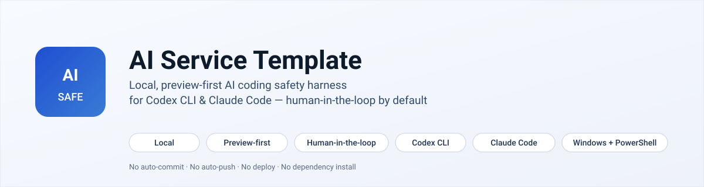
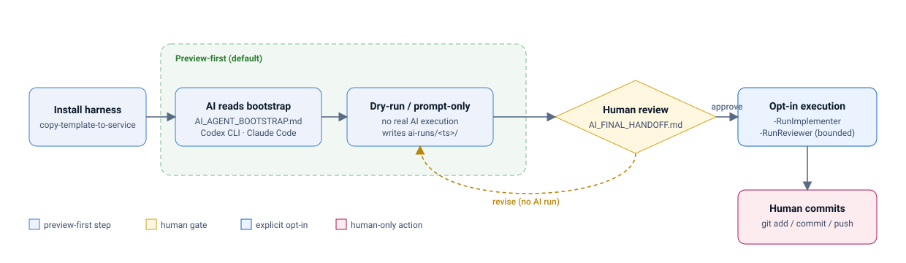

# AI Service Template

[](https://github.com/hwan96-ai/ai-service-template/actions/workflows/pester.yml)
[](https://github.com/hwan96-ai/ai-service-template/releases)
[](LICENSE)
[](https://learn.microsoft.com/powershell/)
[](#requirements)

<p align="center">
  
</p>

> **A Windows/PowerShell AI coding safety harness for Codex CLI and Claude Code. Preview-first. Human-in-the-loop by default.**

 한국어 안내: [README_KO.md](README_KO.md) ·  Deeper guide: [TEMPLATE_USAGE.md](TEMPLATE_USAGE.md) ·  Safety boundaries: [SECURITY.md](SECURITY.md)

## What This Is

A Windows/PowerShell safety harness that wraps Codex CLI and Claude Code workflows in a preview-first process. You run dry-run and prompt-only commands first, inspect an `AI_FINAL_HANDOFF.md`, and only then opt in to real AI execution. The harness never commits, pushes, deploys, or installs dependencies on its own.

This is **not** a generic service scaffold. It is **not** a SaaS framework, a hosted coding service, or an MCP / plugin runtime. It is **not** cross-platform today — Windows + PowerShell only.

## Who It Is For

Use this when you want AI help inside a real repository but do not want automatic commit, push, deploy, or install behavior. It fits developers who already use Codex CLI or Claude Code CLI and want a thin local layer of guardrails, prompt-only artifacts, and a human review gate around them.

## Who It Is Not For

It is not for users wanting a hosted AI coding service, full automation, automatic commits or deploys, or Linux/macOS-first shell support today. It does not replace human judgment; it produces artifacts for humans to review.

## Smallest Useful Workflow

1. Copy the harness into a target service repo (preview, then `-Apply`).
2. Run a dry-run: `.\tools\ai-autopilot.ps1 -DryRun -Goal "..."`.
3. Open the timestamped folder under `ai-runs/` and read `AI_FINAL_HANDOFF.md`.
4. Only if the preview looks safe, opt in to real Codex or Claude execution with explicit flags.

AI agents working in this repo should read [`AI_AGENT_BOOTSTRAP.md`](AI_AGENT_BOOTSTRAP.md) first.

## Template Use (Secondary)

This can be copied into a service repo as a starting point, but its primary value is the AI coding safety workflow, not service scaffolding. If you want a generic service template, this is not it.

## Workflow

<p align="center">
  
</p>

Preview-first by default. Real AI execution requires explicit opt-in. Every run ends with a human-reviewable `AI_FINAL_HANDOFF.md`.

<details>
<summary>Why this exists</summary>

You want Codex CLI or Claude Code CLI to help in a real repository, but you do not want them to commit, push, deploy, install packages, or bypass review. This project is the local safety layer between those AI tools and your repository. It is not a replacement for those CLIs — it wraps workflow scripts, prompts, guardrails, test detection, and final handoff artifacts around them. `/goal` and `/ralph` are workflow prompt conventions for Codex CLI / Claude Code style sessions, not PowerShell commands. End-to-end execution still requires local CLI setup, authentication, and explicit script flags.

</details>

> Template version: `0.6.11`. See [`TEMPLATE_CHANGELOG.md`](TEMPLATE_CHANGELOG.md) for release history. Contribution guide: [CONTRIBUTING.md](CONTRIBUTING.md). An optional `.gitleaks.toml` is included for local secret scanning; see "Optional Secret Scanning" in [SECURITY.md](SECURITY.md).

## Requirements

For baseline dry-run and prompt-only use:

- Windows 10/11
- PowerShell 5.1 or newer
- Git, with Git for Windows recommended
- The copied harness files in the target service repo

For real AI execution, also add:

- Codex CLI installed and authenticated for real Codex execution
- Claude Code CLI installed and authenticated for real Claude review
- ChatGPT/OpenAI account capable of using Codex
- Claude account capable of using Claude Code

Prompt-only and dry-run checks can be useful before both CLIs are ready.

## Optional Tools

- Claude Desktop or Claude Code Desktop
- Claude Code VS Code extension
- Codex web or IDE extension
- Pester for PowerShell self-tests

## Not Required

- GPT API automation
- Auto-commit
- Auto-push
- Deployment credentials
- Dependency installation during harness runs

## Preflight Check

Run these from the repository where you plan to use the harness:

```powershell
git --version
$PSVersionTable.PSVersion
codex --version
claude --version
```

## Self-Tests

If Pester is already installed, run the safety self-tests without installing
anything:

```powershell
Invoke-Pester -Path .\tests\AIServiceTemplate.Safety.Tests.ps1
```

The tests use temporary directories and do not invoke Codex CLI or Claude Code CLI.

## Install Into Another Repo

Start from the repo where you want to install the harness. Run without `-Apply`
first to preview the copy plan.

```powershell
cd D:\some-project

$u = "https://raw.githubusercontent.com/hwan96-ai/ai-service-template/v0.6.11/tools/install-ai-service-template.ps1"
$p = "$env:TEMP\install-ai-service-template.ps1"
Invoke-WebRequest $u -OutFile $p

# Preview first. No files are written.
powershell -ExecutionPolicy Bypass -File $p `
  -TargetRepo . `
  -Version v0.6.11 `
  -IncludeLocalGitignoreRules

# If the preview looks safe, apply the install.
powershell -ExecutionPolicy Bypass -File $p `
  -TargetRepo . `
  -Version v0.6.11 `
  -Apply `
  -IncludeLocalGitignoreRules
```

The installer downloads the tagged GitHub archive, extracts it under `TEMP`,
and runs the template copy script from that archive. It does not use
pipe-to-execute.

Existing `README.md`, `AGENTS.md`, `CLAUDE.md`, `AI_AGENT_BOOTSTRAP.md`, and AI
control docs are preserved by default. After install, ask AI coding agents to
read `AI_AGENT_BOOTSTRAP.md` first. This is a local human-in-the-loop safety
harness. It does not auto-commit, auto-push, deploy, install dependencies, or
add MCP or plugin behavior.

## 2-Minute Quickstart

If you cloned this template repo, first preview or copy it into a target service repo with `tools/copy-template-to-service.ps1`, or use the template repo only for inspection. The `cd D:\your-service-repo` commands below assume the harness files already exist in that target service repo.

The copy script preserves an existing target `README.md` by default and reports
`[skip-existing-readme] README.md` in the preview. Use `-OverwriteReadme` only
when replacing the service README is intentional.
Existing agent and AI control docs are also preserved by default and report
`[skip-existing-control-doc] <file>` in the preview. Use
`-OverwriteControlDocs` only when replacing them is intentional.

Start with dry-run and prompt-only modes. These commands create local review artifacts, but they do not run real Codex or Claude, do not run tests, and do not commit, push, deploy, install dependencies, or use permissive sandbox flags.

```powershell
cd D:\your-service-repo

powershell -ExecutionPolicy Bypass -File .\tools\ai-autopilot.ps1 -DryRun -Goal "service smoke test"

powershell -ExecutionPolicy Bypass -File .\tools\ai-autopilot.ps1 -Implementer codex -DryRun -Goal "Generate a Codex implementation prompt only"

powershell -ExecutionPolicy Bypass -File .\tools\ai-autopilot.ps1 -Reviewer claude -DryRun -Goal "Generate a Claude review prompt only"
```

Expected output: each command writes a timestamped local folder under `ai-runs/` with a human-reviewable `AI_FINAL_HANDOFF.md`. The Codex command also writes a Codex prompt artifact without executing Codex. The Claude command writes a Claude review prompt artifact without executing Claude. Review the handoff before deciding whether to opt in to real AI execution.

See [examples/sample-AI_FINAL_HANDOFF.md](examples/sample-AI_FINAL_HANDOFF.md) for a sanitized sample handoff. For the full safe progression, use `TEMPLATE_USAGE.md`.

## Why Not Just Use Codex, Claude Code, Cursor, Or AGENTS.md?

This project is most useful when you already want Codex CLI and Claude Code CLI,
but want stronger local guardrails around them. It does not replace those tools;
it makes their use more deliberate, reviewable, and repeatable.

| Option | What it is good for | What this harness adds |
| ------ | ------------------- | ---------------------- |
| Raw Codex CLI | Direct implementation help | Conservative run wrapper, dry-run first, sandbox expectations, generated artifacts, no auto-commit, no auto-push, no deploy, no dependency install, and final human handoff. |
| Raw Claude Code CLI | Interactive planning, review, and editing | Review-only path, prompt artifacts, explicit execution gates, and a no-commit/no-push/no-deploy policy. |
| Cursor / aider / similar tools | Productive agentic coding | This project intentionally reduces autonomy with prompt-only defaults, local safety gates, explicit opt-in execution, and bounded fix loops. |
| README.md only | Human-readable guidance | PowerShell scripts, detected-test summaries, local run folders, and handoff artifacts that make the workflow repeatable. |
| AGENTS.md / CLAUDE.md only | Agent instructions | Copy and validation scripts, run artifacts, conservative execution gates, bounded fix loops, and a final human handoff. |

## Who This Is For

- Developers who want Codex CLI or Claude Code CLI help in a real repo while keeping final control local
- Teams that want prompt-only review artifacts before allowing AI execution
- Maintainers who need a repeatable handoff showing git status, detected tests, AI output, review notes, and remaining risks
- Users who want explicit gates before any implementer or reviewer process runs

## Who This Is Not For

- Users looking for a hosted AI coding service
- Teams that want automatic commits, pushes, deploys, or dependency installation
- Projects that need Linux/macOS-first shell support today
- Workflows that intentionally require permissive sandbox flags or bypassed review

## What The Harness Does

- Copies reusable AI control documents and PowerShell scripts into a service repo
- Collects redacted git status and diff summaries without reading secret file contents
- Detects likely local test commands without installing dependencies
- Runs selected opt-in local checks from trusted repositories only when requested
- Generates Codex implementation prompts and can run Codex only with explicit opt-in
- Generates Claude review prompts and can run Claude review-only only with explicit opt-in
- Supports a bounded Codex and Claude fix loop when explicitly enabled
- Writes local run artifacts under `ai-runs/` and ends with `AI_FINAL_HANDOFF.md`

## What The Harness Does Not Do

- It does not understand your service until you fill in `AI_PRODUCT_SPEC.md` and `AI_TASK_QUEUE.md`
- It does not replace Codex CLI, Claude Code CLI, ChatGPT, or Claude accounts
- It does not run Codex or Claude unless the matching run switches are provided
- It does not commit, push, deploy, install dependencies, tag releases, or merge branches
- It does not use `danger-full-access`, bypass, yolo, full-auto, or other permissive sandbox flags
- It does not guarantee trusted repository test scripts are side-effect free; it deny-lists wrapper command text
- It does not replace human review; it creates artifacts for human review

## Repository Layout

```text
D:\ai-service-template
|-- AI_PRODUCT_SPEC.md
|-- AI_ACCEPTANCE_CRITERIA.md
|-- AI_TASK_QUEUE.md
|-- AI_WORKFLOW.md
|-- AI_AGENT_BOOTSTRAP.md
|-- AGENTS.md
|-- CLAUDE.md
|-- README.md
|-- TEMPLATE_USAGE.md
|-- SERVICE_ONBOARDING_CHECKLIST.md
|-- TEMPLATE_CHANGELOG.md
|-- TEMPLATE_MANIFEST.json
|-- examples/
|   `-- sample-AI_FINAL_HANDOFF.md
|-- ai-runs/
|   `-- .gitkeep
`-- tools/
    |-- ai-autopilot.ps1
    |-- collect-context.ps1
    |-- detect-tests.ps1
    |-- write-final-handoff.ps1
    |-- write-claude-review-prompt.ps1
    |-- write-codex-implementation-prompt.ps1
    |-- write-codex-fix-prompt.ps1
    |-- install-ai-service-template.ps1
    |-- copy-template-to-service.ps1
    `-- validate-template-install.ps1
```

### Key Files

| File | Role |
|------|------|
| `tools/ai-autopilot.ps1` | Main local orchestrator. This is where a harness run starts. |
| `AI_PRODUCT_SPEC.md` | Human-written service context for the target repo. |
| `AI_AGENT_BOOTSTRAP.md` | First-read instructions for AI coding agents after install. |
| `AI_TASK_QUEUE.md` | Human-written work queue for the target repo. |
| `AI_ACCEPTANCE_CRITERIA.md` | Completion and safety criteria. |
| `AGENTS.md` | Guardrails for Codex CLI. |
| `CLAUDE.md` | Guardrails for Claude Code CLI. |
| `TEMPLATE_USAGE.md` | Deeper usage guide. |
| `SERVICE_ONBOARDING_CHECKLIST.md` | Checklist for applying the harness to a service repo. |
| `tools/copy-template-to-service.ps1` | Preview-first copy script for installing the harness into another repo. |
| `tools/validate-template-install.ps1` | Install validator and dry-run smoke-check helper. |
| `examples/sample-AI_FINAL_HANDOFF.md` | Sanitized sample output so you can see the review artifact before running the harness. |
| `ai-runs/` | Local run artifacts. Timestamped run folders are ignored by git. |

## Detailed Usage

For the full install and operating guide, see [TEMPLATE_USAGE.md](TEMPLATE_USAGE.md).
For a step-by-step adoption checklist, see
[SERVICE_ONBOARDING_CHECKLIST.md](SERVICE_ONBOARDING_CHECKLIST.md).

Start with dry-run and prompt-only commands. Move to real Codex or Claude
execution only after the generated prompts and `AI_FINAL_HANDOFF.md` are
reviewed by a human.

## Release History

This template is versioned in [TEMPLATE_CHANGELOG.md](TEMPLATE_CHANGELOG.md).
The README intentionally describes current capabilities instead of construction
phases.

## License

This repository is released under the MIT License. See [LICENSE](LICENSE).
